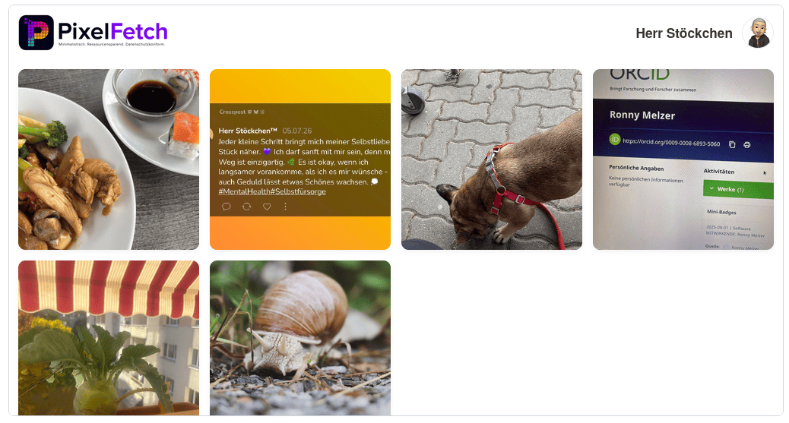
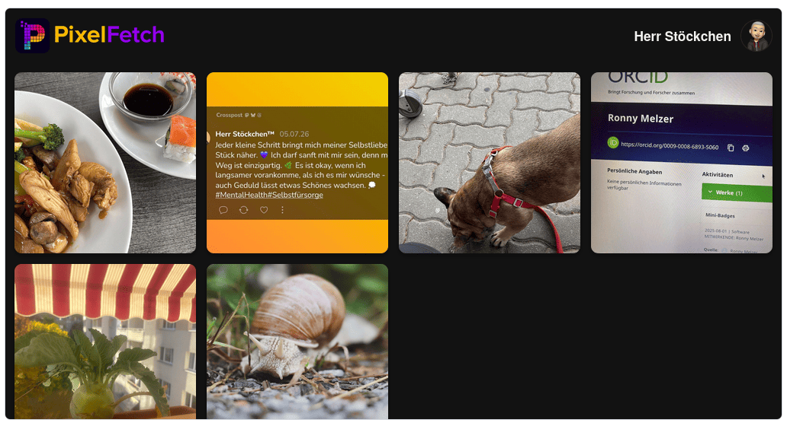

<h1 align="center">
  
</h1>
<div align="center">

          [](https://ci.commitcloud.net/repos/15) 

[](https://www.buymeacoffee.com/RonDev)
[](https://ko-fi.com/U6U31EV2VS)
[](https://www.paypal.com/donate/?hosted_button_id=PWY939TPCQ3RA)
</div>
<hr>

PixelFetch ist eine minimalistische, extrem ressourcensparende und zu 100% datenschutzkonforme Multi-Account-Galerie für Pixelfed. Das Skript nutzt ein automatisiertes **Lazy Caching Verfahren** und läuft sowohl auf klassischem Webspace (wie All-Inkl.com) als auch containerisiert in Docker-Umgebungen.

<div align="center">
 
</div>

## Features

- **Multi-Account:** Verwalte unbegrenzt viele Pixelfed-Accounts (auch von unterschiedlichen Instanzen) über eine zentrale Installation.
- **Lazy Caching:** Die Daten und Bilder werden nur aktualisiert, wenn die Galerie tatsächlich besucht wird und der Cache abgelaufen ist. Keine störenden Cronjobs im Hintergrund nötig.
- **100% DSGVO-konform:** Bilder werden lokal auf deinen Server geladen. Die Browser deiner Webseitenbesucher kommunizieren niemals mit fremden Pixelfed-Instanzen. Keine IP-Leaks.
- **Zero Dependencies:** Reines PHP ohne dicke Composer-Pakete. CSS und JS sind nativ (Vanilla).
- **Automatischer Dark-Mode:** Erkennt die Systemeinstellungen des Nutzers oder lässt sich global erzwingen.

## Installation auf Shared Hosting

1. Kopiere den gesamten Inhalt dieses Repositories in ein Verzeichnis auf deinem Server.
2. Route deine Domain/Subdomain zwingend in den Unterordner `/public`.
3. Kopiere die Datei `.env.example` zu `.env` und passe die Werte an.
4. Kopiere die Datei `config/accounts.json.example` zu `config/accounts.json` und trage dort deine Pixelfed-Instanzen und dazugehörigen Personal Access Tokens (PAT) ein.
5. Stelle sicher, dass der Ordner `/storage` für den Webserver beschreibbar ist (`CHMOD 755` oder `777`).

## Installation via Docker

Nutze das vorgefertigte Docker-Image. Das Verzeichnis `/var/www/html/storage` muss als persistentes Volume gemountet werden, damit die Cachedaten nach einem Container-Neustart erhalten bleiben:

```yaml
version: '3.8'

services:
  pixelfetch:
    image: ghcr.io/rondevhub/pixelfetch:latest
    container_name: pixelfetch
    ports:
      - "8080:80"
    environment:
      - THEME_MODE=auto
      - DEFAULT_CACHE_TTL=3600
    volumes:
      - ./storage:/var/www/html/storage
      - ./config:/var/www/html/config
    restart: unless-stopped
```

## Lizenz

Freie Software. Modifiziere und teile sie ganz nach deinen Wünschen.
